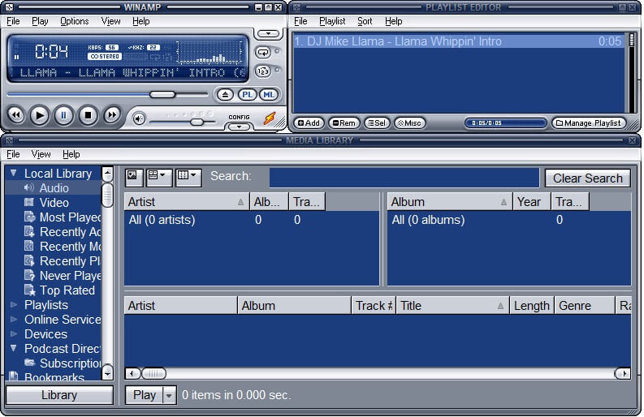

# Design Comparison: Winamp Modern vs OneAmp Current

## Screenshots Analysis

### Winamp Modern (Reference)

### OneAmp Current

---

## Key Differences

### 1. **Layout & Structure**

| Aspect | Winamp Modern | OneAmp Current | Gap |
|--------|---------------|----------------|-----|
| **Structure** | Compact, multi-panel | Single vertical panel | ⭐⭐⭐⭐⭐ |
| **Player Section** | Small, top-left corner | Large, centered | ⭐⭐⭐⭐ |
| **Visualizer** | Integrated in player | Separate below | ⭐⭐⭐ |
| **Library** | Dedicated panel (right) | None | ⭐⭐⭐⭐⭐ |
| **Playlist** | Table view with columns | Simple list | ⭐⭐⭐⭐ |

### 2. **Player Section**

| Element | Winamp Modern | OneAmp Current | Gap |
|---------|---------------|----------------|-----|
| **Timer** | Small LCD (top-left) | Large centered (01:16) | ⭐⭐⭐ |
| **Track Info** | Scrolling text | Static centered | ⭐⭐ |
| **Visualizer** | Integrated waveform | Separate spectrum bars | ⭐⭐⭐ |
| **Progress Bar** | Thin horizontal | Thick horizontal | ⭐ |
| **Buttons** | Small, compact row | Large circular 3D | ⭐⭐⭐⭐ |
| **Volume** | Slider + number | Not visible | ⭐⭐⭐ |

### 3. **Colors & Theme**

| Aspect | Winamp Modern | OneAmp Current | Gap |
|--------|---------------|----------------|-----|
| **Primary** | Blue gradient (#4080C0) | Dark gray/blue | ⭐⭐ |
| **Background** | Light blue-gray | Dark charcoal | ⭐⭐⭐ |
| **Accent** | Bright blue | Cyan | ⭐ |
| **Text** | White on blue | Cyan/white on dark | ⭐⭐ |
| **Style** | Windows XP-era | Modern dark | ⭐⭐⭐ |

### 4. **Typography**

| Element | Winamp Modern | OneAmp Current | Gap |
|---------|---------------|----------------|-----|
| **Timer** | LCD-style, small | Large sans-serif | ⭐⭐⭐ |
| **Track** | Small, scrolling | Medium, static | ⭐⭐ |
| **Playlist** | Monospace table | Sans-serif list | ⭐⭐ |

### 5. **Controls**

| Control | Winamp Modern | OneAmp Current | Gap |
|---------|---------------|----------------|-----|
| **Play/Pause** | Small button | Large circular 3D | ⭐⭐⭐ |
| **Prev/Next** | Small buttons | Large circular 3D | ⭐⭐⭐ |
| **Stop** | Small button | Large circular 3D | ⭐⭐⭐ |
| **Volume** | Slider visible | Not visible | ⭐⭐⭐ |
| **Seek** | **Interactive** ✅ | **Not interactive** ❌ | ⭐⭐⭐⭐⭐ |

### 6. **Playlist**

| Feature | Winamp Modern | OneAmp Current | Gap |
|---------|---------------|----------------|-----|
| **View** | Table (columns) | Simple list | ⭐⭐⭐⭐ |
| **Columns** | Artist, Album, Track#, Title, Length, Genre | Track number + title | ⭐⭐⭐⭐⭐ |
| **Search** | Search bar | None | ⭐⭐⭐⭐ |
| **Sorting** | Click columns | None | ⭐⭐⭐⭐ |

### 7. **Library (Media Library)**

| Feature | Winamp Modern | OneAmp Current | Gap |
|---------|---------------|----------------|-----|
| **Panel** | Dedicated right panel | None | ⭐⭐⭐⭐⭐ |
| **Tree View** | Audio, Video, Playlists | None | ⭐⭐⭐⭐⭐ |
| **Filters** | Artist, Album, Year | None | ⭐⭐⭐⭐⭐ |
| **Search** | Integrated | None | ⭐⭐⭐⭐ |

---

## Critical Missing Features

### 🚨 Priority 1 (Critical)

1. **Interactive Seek** ❌
   - Cannot click on progress bar to seek
   - **User complaint**: "il n'est pas possible d'avancer dans la musique"

2. **Compact Layout** ❌
   - OneAmp is too vertically stretched
   - Winamp is compact and efficient

3. **Proper Playlist Table** ❌
   - OneAmp has simple list
   - Winamp has rich table with columns

### ⚠️ Priority 2 (Important)

4. **Media Library Panel** ❌
   - Completely missing in OneAmp
   - Core feature of Winamp

5. **Volume Control** ❌
   - Not visible in OneAmp
   - Always visible in Winamp

6. **Scrolling Track Info** ❌
   - OneAmp shows static text
   - Winamp scrolls long titles

### 📝 Priority 3 (Nice to Have)

7. **LCD-style Timer** ⚠️
   - OneAmp has large modern font
   - Winamp has retro LCD

8. **Integrated Visualizer** ⚠️
   - OneAmp has separate section
   - Winamp integrates in player

9. **Blue Gradient Theme** ⚠️
   - OneAmp is dark modern
   - Winamp is blue XP-era

---

## Design Philosophy Mismatch

### Winamp Modern
- **Compact** : Maximum info in minimum space
- **Functional** : Every pixel serves a purpose
- **Windows XP Era** : Blue gradients, beveled edges
- **Information Dense** : Library + Player + Playlist visible
- **Professional** : Looks like a serious audio tool

### OneAmp Current
- **Spacious** : Large elements, lots of padding
- **Modern Dark** : Contemporary dark theme
- **Minimalist** : Few elements visible at once
- **Visual Focus** : Large album art, big buttons
- **Casual** : Looks like a consumer app

---

## Proposed Changes for v0.14

### Phase 1: Critical Fixes
1. ✅ **Implement Interactive Seek**
   - Click on progress bar to jump
   - Drag to scrub
   - Show time on hover

2. ✅ **Compact Layout**
   - Reduce vertical spacing
   - Smaller fonts
   - Tighter grouping

3. ✅ **Playlist Table**
   - Columns: #, Title, Artist, Album, Duration
   - Sortable columns
   - Alternating row colors

### Phase 2: Feature Parity
4. ✅ **Volume Slider**
   - Always visible
   - Vertical or horizontal
   - Percentage display

5. ✅ **Scrolling Track Info**
   - Marquee effect for long titles
   - Smooth animation

6. ✅ **LCD Timer**
   - Retro 7-segment font
   - Smaller size

### Phase 3: Advanced
7. ✅ **Media Library Panel**
   - Tree view (Audio, Playlists)
   - Artist/Album filters
   - Search functionality

8. ✅ **Blue Winamp Theme**
   - Blue gradients
   - Beveled edges
   - XP-era aesthetic

---

## Immediate Action Plan

### v0.14.0 Goals

**Must Have** :
1. Interactive seek on progress bar
2. Volume slider visible
3. Compact layout (reduce spacing)
4. Playlist table with columns

**Should Have** :
5. Scrolling track info
6. LCD-style timer
7. Smaller control buttons

**Could Have** :
8. Blue Winamp theme option
9. Media library panel
10. Integrated visualizer

---

## Conclusion

**Current State** : OneAmp is a modern dark-themed player  
**Target State** : Winamp Modern clone  
**Gap** : ⭐⭐⭐⭐⭐ (Very Large)

**Estimated Work** :
- Phase 1 (Critical): 4-6 hours
- Phase 2 (Feature Parity): 6-8 hours
- Phase 3 (Advanced): 10-12 hours
- **Total**: 20-26 hours

**Recommendation** : Start with Phase 1 (v0.14.0) to address user's immediate complaint about seek functionality.
