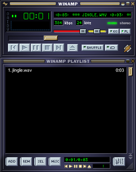

# OneAmp

> *It really whips the penguin's ass.*

<p align="center">
  
</p>

A **cross-platform**, **retro-modern** Winamp-faithful audio player, written in Rust. Native on Linux, macOS, and Windows — no Wine, no compatibility shim, just a real native binary that loads your old `.wsz` skins and plays your music.

Retro-modern in the same spirit as Rust itself: a modernisation built on the lessons of the past. The interface is 25 years old by design; the audio stack underneath it is 2026.

---

## Why "One"?

One ring to rule them all — minus the world-domination subtext. **One** audio player, doing the music side of the desktop properly. Linux-born (Debian-family was the first home), macOS and Windows now native too.

## What it's trying to be

A Winamp — native on Linux, macOS, and Windows. No Wine, no Bottles, no glue around a Win32 binary — just an ELF / Mach-O / PE that opens an MP3, plays it, and *looks like the player you remember*. And while we're rebuilding a 25-year-old player from scratch in 2026, we may as well do it in Rust, so the next 25 years are someone else's problem.

## Why this exists at all

I grew up on Windows. Liked it, mostly because I didn't know any better. Windows 10 was fine — not as good as 7, but fine. Then 11 happened: a cascade of unanswerable *whys*. Then Microsoft announced Windows 12 with bright, mandatory, always-on AI snooping baked in. That was the line.

The Linux transition was almost painless. **One** exception: I tried every audio player I could find — Audacious, Clementine, Strawberry, Rhythmbox, Lollypop, DeaDBeeF, QMMP, you name it — and **not a single one** made me happy. And as a young boomer, I'd never really left Winamp anyway.

So: build the thing.

## What's in the box

- **Audio engine** — Symphonia decoding (MP3, FLAC, OGG / Vorbis, WAV, AAC, M4A / MP4, ALAC), rodio output over a lock-free SPSC ring (no mutex on the cpal real-time callback — no priority inversion under compositor load), gapless transitions between same-format tracks (preloaded decoder swapped into the live audio stream — no device rebuild, no audible silence). Pre-buffer brickwall limiter (-1 dBFS ceiling, zero-attack instant clamp, 100 ms one-pole release) sits at the end of the per-sample chain, so it sees the worst-case signal regardless of the master-volume slider. Stream position is read from each packet's PTS (`packet.ts()` + `time_base.calc_time`), not from a frame-count accumulator, so a glitchy MP3's skipped frame doesn't drift the position slider by several seconds.
- **Internet radio + podcasts** — `Ctrl+L` or the playlist's right-click *Add URL…* takes an `http://` / `https://` URL and streams it through a custom symphonia `MediaSource` (`ureq 3` + rustls + webpki-roots; no system OpenSSL). ICY metadata (`Icy-MetaData: 1` request, `icy-metaint` response) is parsed inline — metadata blocks are stripped from the byte stream so the decoder never sees them, and the latest `StreamTitle='Artist - Title'` is published wait-free into an `ArcSwap<String>` snapshot the audio thread polls each tick. The currently-playing playlist row's title is rewritten to the live "now playing" string and (when track notifications are on) a toast fires on each change.
- **Tag editor** — right-click any playlist row → *Edit tags…* opens a modal that reads the file's tags via `lofty 0.24`, lets you edit Title / Artist / Album / Album artist / Genre / Year / Track # / Comment, and writes them back in place. Format support tracks lofty: ID3v1 / ID3v2.3 / ID3v2.4 (MP3), Vorbis Comments (FLAC, OGG), MP4 atoms (M4A / MP4), RIFF (WAV), APE. Non-edited tags (cover art, ReplayGain, MusicBrainz IDs) are preserved on save. After a successful write the playlist row's cached metadata refreshes in place — no restart.
- **Customisable playlist row format** — default `{artist} - {title}` (Winamp / iTunes convention), editable in-app via the playlist right-click *Edit display format…* dialog. Tokens: `{artist}`, `{title}`, `{album}`, `{genre}`, `{tracknumber}` (zero-padded to 2 digits), `{year}`, `{duration}` (`M:SS`), `{filename}`. Missing tags collapse separators automatically — an untagged file under `"{artist} - {title}"` falls back to the filename instead of rendering as `" - "`.
- **10-band equalizer** — RBJ biquads at ISO 266 / IEC 61260 octave centres (`31.5, 63, 125, 250, 500, 1000, 2000, 4000, 8000, 16000` Hz), real-time, ±20 dB range, zero-alloc on the decode path (`process_stereo_in_place` mutates the decoder's output buffer directly). Constant-Q, gain-dependent bandwidth — `Q = √2 / (1 + 1/A)` with `A = 10^(|gain_db|/40)` — so heavy boosts focus on their target band instead of smearing across two octaves. Coefficient updates ramp linearly over ~10 ms (∼441 samples at 44.1 kHz), so dragging a slider is click-free. Per-preset preamp values auto-computed from the cascaded transfer function (`Equalizer::headroom_db`, sampled at 4096 log-spaced points 20 Hz–20 kHz), so the pre-buffer limiter doesn't get pumped by aggressive presets — Bass Boost lands at ≈-9 dB, Hip-Hop / Club ≈-8 dB, Metal ≈-7 dB. 16 built-in presets with documented design intent — notably Vocal Boost centres on the 1–4 kHz vocal-presence octave (boosting 250 Hz, as the naïve preset does, adds mud, not intelligibility); Bass Boost and Treble Boost are clean shelves; Laptop Speakers cuts the typical 1–3 kHz "honkiness" instead of boosting it. Pixel-perfect skinned EQ window with spline preview.
- **Loudness compensation** — opt-in Fletcher-Munson / ISO 226 curve under Options → Loudness. Two RBJ shelves (120 Hz low + 4 kHz high, S=1) tilt up as master volume drops so perceived tonal balance stays roughly constant at low listening levels (≈1.8 dB lift at volume = 0.5, 3.1 dB at 0.3, 6 dB cap). Mathematically pass-through at full volume; coefficient ramping over 10 ms means dragging the volume slider doesn't click; inserted after the EQ and before preamp / balance / limiter so the shelves shape the EQ'd signal and the limiter sees the post-loudness peak.
- **Stereo balance** — constant-power sin/cos panning law (`θ = (balance + 1) · π/4`, `L = cos θ`, `R = sin θ`). Sum of squares stays at 1.0 across the entire range, so perceived loudness stays flat across the pan range — no 3 dB centre hump like the naïve "cut one side, leave the other at 1.0" law gives.
- **Playlist** — drag-drop files and folders, M3U save/load, double-click to play, native-skinned frame, resizable.
- **Native `.wsz` skins** — drop any classic Winamp skin onto OneAmp via `Alt+S`. A bundled default skin ships embedded in the binary, so first launch is never naked egui.
- **Visualizer** — three modes (click-cycle Spectrum → Oscilloscope → Peak meter → Off), all painted in the skin's authentic viscolor palette:
    - *Spectrum analyzer* — 2048-point Hann-windowed FFT with DC removal (DC-biased files no longer pin bins 0/1 high), 21 Hz bin resolution (distinguishes 31.5 Hz and 63 Hz EQ bands), cap at 0.95 × Nyquist (~21 kHz — brilliance / air bands are no longer dead), dB-correct display (`magnitude / (FFT · 0.5) → 20·log10 → map [-60, 0] dBFS → [0, 1]`), max-of-bin reduction so transients show as crisp peaks instead of being averaged out. 16 log-spaced bins emitted directly by the engine (no double-binning).
    - *Oscilloscope* — min/max decimation with a zero-crossing trigger, so a periodic signal renders at a stable phase across refreshes (no "scrolling") and an 8 kHz sine at 44.1 kHz keeps its full ±1.0 excursion instead of aliasing into a phantom slow wave.
    - *Peak / RMS meter* — stereo bars (L on top, R on bottom) reading from the **post-limiter** signal, so they reflect what's actually heading to the device. Fill tracks one-pole smoothed RMS (τ = 300 ms, sample-rate-aware), bar width is log-scaled `-40..0 dBFS → 0..76 cells`, peak-hold cap falls at 0.6/s (≈1.7 s full-scale decay) for the classic VU peak-hold feel.
- **Custom chrome** — no OS title bar fighting the skin. Pixel-perfect drag, double-click to shade, the whole bit.
- **Update check** — a one-shot background ping to the GitHub Releases API at startup, surfaced as a single desktop notification when a newer version ships. No download, no auto-install, no network call after the first second of launch.
- **Distribution** — every tag produces a tarball, a `.deb`, an `.rpm`, a Flatpak bundle, a Snap, a Windows MSI + portable ZIP, and a macOS universal DMG. Arch users build from source via the [`PKGBUILD`](packaging/arch/PKGBUILD).

## What this is *not*

A media library. A CD ripper. An iPod sync tool. A podcast subscription manager (we play URLs you paste in, we don't crawl RSS feeds). A music-discovery service. A "smart" anything. A 17-tab Swiss-army-app.

It's a music player. It plays music. It looks good doing it.

## Install

Grab the artefact that fits your OS from the [latest release](https://github.com/all3f0r1/oneamp/releases/latest).

### Linux

| Format | How |
|---|---|
| **`.deb`** (Debian / Ubuntu / Mint / …) | `sudo apt install ./oneamp-vX.Y.Z-linux-x86_64.deb` |
| **`.rpm`** (Fedora / openSUSE) | `sudo dnf install ./oneamp-vX.Y.Z-x86_64.rpm` |
| **Flatpak** (anything else) | `flatpak install --user OneAmp-vX.Y.Z-x86_64.flatpak && flatpak run io.github.all3f0r1.OneAmp` |
| **Tarball** | `tar xzf oneamp-vX.Y.Z-linux-x86_64.tar.gz && ./oneamp-vX.Y.Z-linux-x86_64/oneamp` |
| **Snap** (manual) | `sudo snap install --dangerous ./oneamp-vX.Y.Z-amd64.snap` — Snap Store publication pending. |
| **Arch** (source) | `git clone … && cd packaging/arch && makepkg -si` — see [`packaging/arch/README.md`](packaging/arch/README.md). |

### Windows

| Format | How |
|---|---|
| **MSI installer** (recommended) | Double-click the `.msi`, accept the UAC prompt, follow the wizard. Installs to `C:\Program Files\OneAmp\` with Start Menu + optional desktop shortcut, and upgrades over a previous install in place. Unsigned — SmartScreen still warns on first launch (*More info → Run anyway*). |
| **Portable ZIP** | Unzip anywhere, run `oneamp.exe`. Same SmartScreen caveat; right-click `oneamp.exe` → *Properties → Unblock* if Windows quarantines the file. |

### macOS

| Format | How |
|---|---|
| **Universal DMG** (Intel + Apple Silicon) | Open the DMG, drag `OneAmp.app` to `/Applications`. Unsigned / unnotarised — on first launch right-click → *Open*, then *Open* in the Gatekeeper dialog. Subsequent launches are normal double-click. |

## Build from source

```bash
git clone https://github.com/all3f0r1/oneamp
cd oneamp
cargo build --release -p oneamp-desktop
./target/release/oneamp
```

Toolchain: stable Rust 1.85+ (edition 2024). System
dependencies vary by OS:

- **Linux (Debian / Ubuntu / Mint)** —
  `sudo apt install build-essential pkg-config libasound2-dev libxcb-render0-dev libxcb-shape0-dev libxcb-xfixes0-dev libxkbcommon-dev libdbus-1-dev libgtk-3-dev libayatana-appindicator3-dev`
- **Linux (Fedora)** —
  `sudo dnf install gcc pkgconf alsa-lib-devel libxkbcommon-devel wayland-devel dbus-devel gtk3-devel libayatana-appindicator3-devel`
- **Linux (Arch)** — `sudo pacman -S base-devel alsa-lib libxkbcommon wayland dbus gtk3 libayatana-appindicator`
- **macOS** — Xcode Command Line Tools (`xcode-select --install`).
  Universal `.app` + `.dmg`: `rustup target add x86_64-apple-darwin aarch64-apple-darwin && bash packaging/build-mac-app.sh`.
- **Windows** — MSVC build tools (the standard `rustup-init.exe`
  installer offers them). No extra system libraries needed.

## Hotkeys

Authentic Winamp where possible.

| Key | Action |
|---|---|
| `Space` | Play / pause |
| `S` | Stop |
| `N` | Next track |
| `P` | Previous track |
| `L` / `Ctrl+O` | Open file |
| `Shift+L` / `Ctrl+Shift+O` | Open folder (recursive) |
| `Ctrl+L` | Open URL (internet radio / podcast) |
| `V` | Toggle shuffle |
| `R` | Cycle repeat (off → all → one) |
| `Alt+E` | Toggle playlist window |
| `Alt+G` | Toggle equalizer window |
| `Alt+M` | Window shade |
| `Alt+S` | Load `.wsz` skin |
| `Ctrl+T` | Toggle "Always on top" (X11 only) |
| `F1` / `?` | Toggle hotkey cheat-sheet |

## Architecture

Three threads, three transports picked to fit the load:

1. **GUI** (`egui` + `wgpu`) — input, skin rendering, UI state.
2. **Audio** (`symphonia` + `rodio`) — decoding, EQ, loudness, balance, preamp, limiter, output. Commands arrive over a `crossbeam_channel` (`recv_timeout(5 ms)` — the thread parks in the kernel when idle instead of busy-spinning), PCM exits via a lock-free `ringbuf` SPSC split to the cpal real-time callback (wait-free `try_pop`, drain-on-seek via an `AtomicBool` flag picked up consumer-side).
3. **Visualization** — reads spectrum / waveform / meter snapshots via `Arc<ArcSwap<…>>` accessors (`AudioEngine::latest_spectrum`, `latest_waveform`, `latest_meter`). Wait-free in both directions, bounded at one `Arc` per refresh — a paused or throttled UI can't pile up unread events the way an unbounded channel would.

The cross-platform desktop integrations (single-instance IPC, media bus, notifications) live behind `oneamp-desktop/src/platform/` and route to per-OS backends via `interprocess`, `souvlaki`, and `notify-rust`.

Workspace layout:

- `oneamp-core` — audio engine + WSZ skin loader, no GUI deps.
- `oneamp-desktop` — egui app, window coordination, skin renderer, platform abstraction layer.
- `oneamp-cli` — minimal CLI player, mostly for smoke-testing the engine.

## Status

Pixel-perfect WSZ rendering: done. Cross-platform distribution pipeline (Linux `.deb` / `.rpm` / Flatpak / Snap / Arch source, macOS universal DMG, Windows MSI + ZIP): done. Up next: code signing for macOS and Windows. Per-version detail in [`CHANGELOG.md`](CHANGELOG.md).

## License

MIT or Apache-2.0, your pick. See [`LICENSE-MIT`](LICENSE-MIT) and [`LICENSE-APACHE`](LICENSE-APACHE).

## Credits

- The original Winamp team — *it really whipped the llama's ass.*
- The Strider, Fyre/SacRat, and Skinz crews for keeping the WSZ format documented decades after the fact.
- The Rust audio crowd — Symphonia, rodio, cpal, fundsp, egui — without whom this would still be a daydream on a sticky note.
